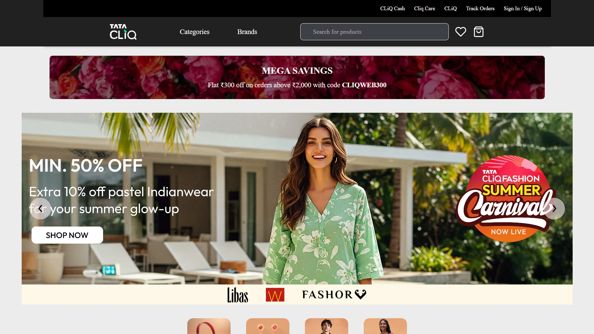
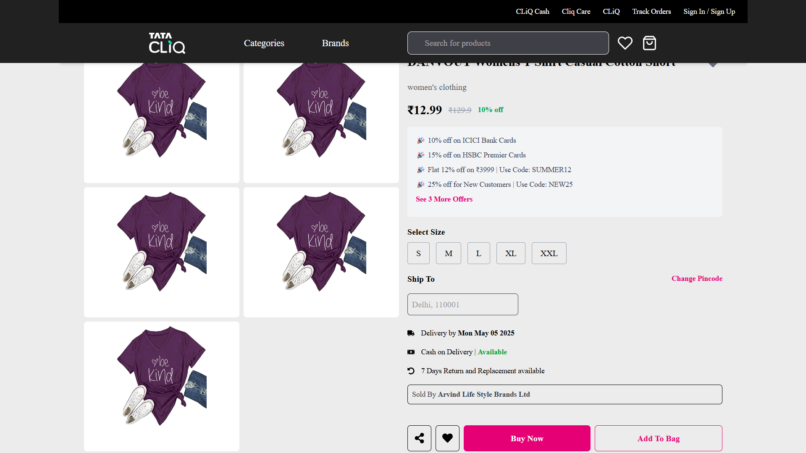
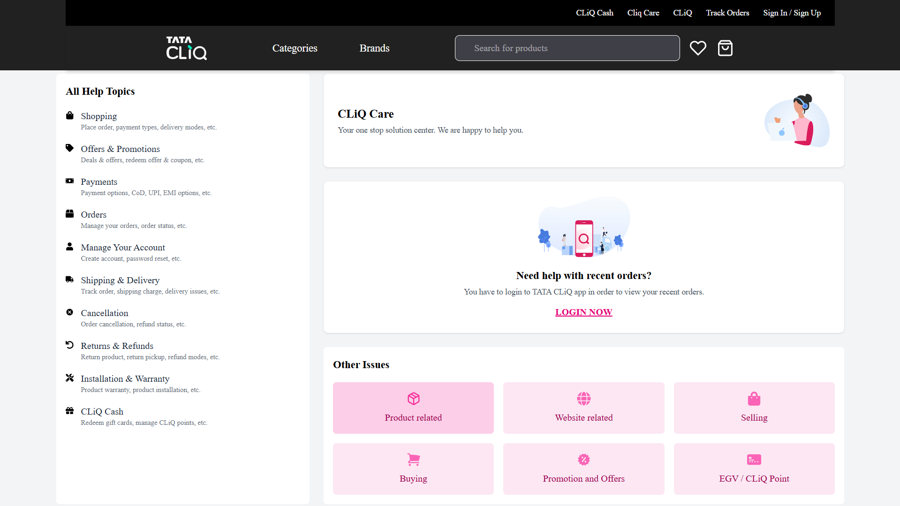
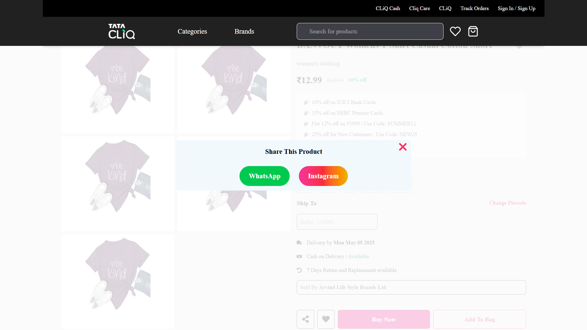
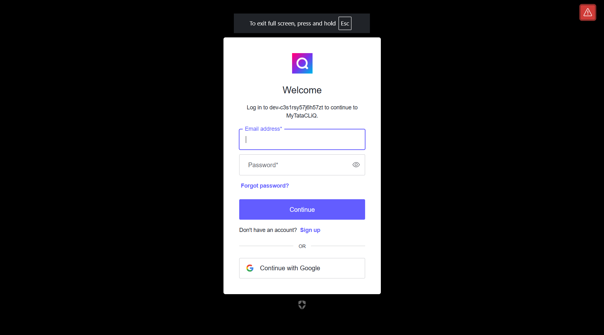

# 🛒 MyTataCLiQ Frontend Web App

[](https://vitejs.dev/)
[](https://reactjs.org/)
[](https://tailwindcss.com/)
[](https://redux-toolkit.js.org/)
[](https://auth0.com/)


A fast, responsive e-commerce frontend inspired by [Tata CLiQ](https://www.tatacliq.com), built with React 19, Vite, TailwindCSS 4, Redux Toolkit, and Auth0 authentication. Deployed on **Firebase Hosting** for fast global delivery.

🔗 **Live App**: [https://mytatacliq.web.app](https://mytatacliq.web.app)

---

## ✨ Features

- ⚡ **Fast builds** with Vite
- 🗏️ Category-specific product views
- 🎨 Fully **responsive design** using Tailwind CSS and disabled zoom from trackpad
- 🔐 Auth0 login support
- 💖 Wishlist system powered by Redux Toolkit
- 🖼️ Hero image **slider with autoplay**
- 🔄 Dynamic routing using React Router v7
- 🔬 Component testing with Vitest & Testing Library
- 📤 **Share products via WhatsApp & Instagram** buttons
- 📦 **Cart & Wishlist functionality** with persistent state
- 📘 **Care page** for customer support

---

## 📦 Tech Stack

| Technology        | Role                                 |
|-------------------|--------------------------------------|
| `React 19`        | UI framework                         |
| `Vite 6`          | Development & build tooling          |
| `Tailwind CSS 4`  | Utility-first CSS framework          |
| `Redux Toolkit`   | State management                     |
| `React Router Dom` | Page routing                         |
| `Auth0`           | Secure authentication                |
| `Vitest` + `RTL`  | Unit/component testing               |
| `Firebase Hosting`| Production deployment                |

---

## 📂 Project Structure

```bash
src/
├── assets/                # Static assets
├── components/            # Reusable components
├── mini-Compo/            # Smaller, isolated UI units
├── pages/                 # Page-level components
├── redux/                 # Redux store and slices
├── App.jsx                # Main application
├── main.jsx               # Entry point
└── index.css              # Global styles
```

---

## 💠 Getting Started

### 🔧 Install dependencies

```bash
npm install
```

### ▶️ Run development server

```bash
npm run dev
```

### 📦 Build for production

```bash
npm run build
```

### 👀 Preview production build

```bash
npm run preview
```

---

## 🧪 Running Tests

We use [`Vitest`](https://vitest.dev) and [`@testing-library/react`](https://testing-library.com/react) for unit and component tests.

```bash
npm run test


---

## 🔐 Auth0 Configuration

To use authentication:

1. Set up your **Auth0 Application**.
2. Create a `.env` file in root:

```env
VITE_AUTH0_DOMAIN=your-domain.auth0.com
VITE_AUTH0_CLIENT_ID=your-client-id
VITE_BASE_URL=http://localhost:5173
```

3. Restart the dev server.

---

## 🚀 Deployment

This project is deployed on **Firebase Hosting**.

- 🔗 **Live App**: [https://mytatacliq.web.app](https://mytatacliq.web.app)
- Firebase CLI is used for deployment:

```bash
firebase deploy
```

> Ensure `firebase.json` and `build` folder are configured properly.

---

## 📸 Screenshots

<div align="center">

|  |  |
|:--:|:--:|
| 🏠 Home Page | 🧾 Product |


|  |  |
|:--:|:--:|
| 💬 Care Page | 📤 Share Buttons (WhatsApp & Instagram) |

|  |  |
|:--:|:--:|
| 🔐 Login Page |  |

</div>

---

## 💡 Challenges Faced

### 1. 🧪 Testing Dynamic UI
- Slider component uses `backgroundImage`, which made testing with `getByRole('img')` unreliable.
- Solution: used `data-testid` and state-based assertions instead.

### 2. 🧹 Tailwind + Custom Styling
- Tailwind v4 introduced some structural changes and purging tweaks.
- Tweaked `vite.config.js` for safe class detection in dynamic content.

### 3. 🔄 React Router Dom v7 
- Dynamic routing via `useParams()` needed care while handling category routes.
- Ensured layout consistency on refresh and direct access to nested paths.

### 4. 📤 Social Media Sharing
- WhatsApp and Instagram buttons were added using `encodeURIComponent` and anchor schemes for broader compatibility.

---

## 🙌 Contributions

Pull requests are welcome! If you have suggestions or bug fixes, feel free to open an issue or PR.


---

## 🤝 Acknowledgements

- [Tata CLiQ](https://www.tatacliq.com) – for design inspiration
- [Auth0](https://auth0.com) – secure authentication
- [Vite](https://vitejs.dev) – ultra-fast dev server
- [Tailwind CSS](https://tailwindcss.com) – beautiful utilities
- [Firebase](https://firebase.google.com) – hosting 

---

## 🎓 Project Context

This project was developed as part of **AlmaBetter's Sprint 1 Capstone Project** for the Full Stack Web Development Program. It represents practical application of frontend concepts including React, TailwindCSS 4, component testing, state management, and modern tooling like Vite.

> **Special thanks to [AlmaBetter](https://almabetter.com)** for providing world-class mentorship, project guidance, and real-world oriented learning!

> **Anand Jha 💖🌿**

